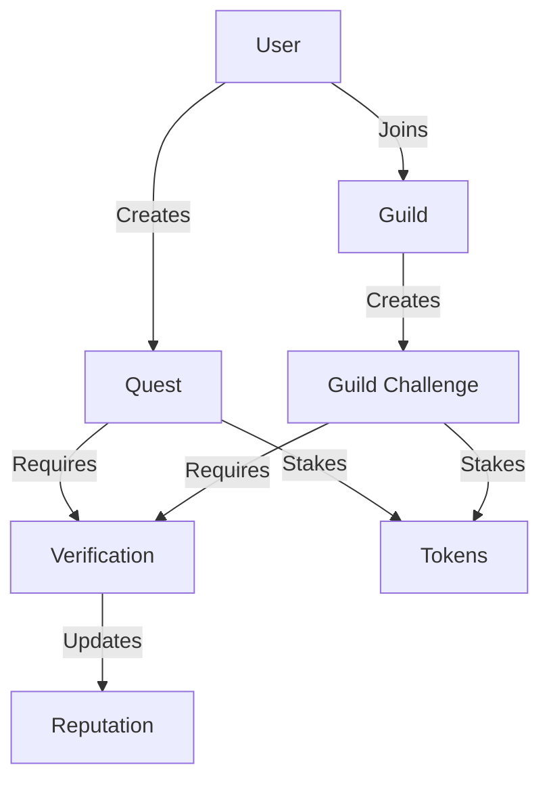

# QuestNest Development Journey

QuestNest is a decentralized platform that transforms personal development into an engaging, gamified experience on the Stacks blockchain. Users create personalized quests, stake tokens, join communities, and earn rewards for achieving their goals.

## Overview

QuestNest enables users to:
- Create personalized development quests with token stakes
- Join communities (guilds) based on shared interests
- Participate in collective challenges
- Build verifiable on-chain reputations
- Earn rewards for completing commitments

The platform combines accountability, social connection, and financial incentives to create a compelling framework for lasting habit formation and goal achievement.

## Architecture

QuestNest is built around three core components: Quests, Guilds, and Verification systems.



### Core Components:
1. **Quests**: Personal development goals with stakes and deadlines
2. **Guilds**: Community groups for collective challenges
3. **Verification System**: Multi-tiered verification (self, peer, authority)
4. **Reputation System**: Tracks user achievements and trustworthiness

## Contract Documentation

### Quest Management
- `create-quest`: Creates a new personal development quest
- `request-quest-verification`: Marks a quest as ready for verification
- `verify-quest`: Validates quest completion by authorized verifiers
- `fail-quest`: Marks a quest as failed

### Guild System
- `create-guild`: Establishes a new community group
- `join-guild`: Allows users to join existing guilds
- `create-guild-challenge`: Creates collective challenges within guilds
- `join-guild-challenge`: Enables participation in guild challenges

### Verification System
- `register-as-verifier`: Registers authorized verifiers
- `verify-guild-challenge`: Validates challenge completions
- `can-verify-quest`: Checks verification permissions

## Getting Started

### Prerequisites
- Clarinet
- Stacks wallet
- Test STX tokens for staking

### Basic Usage

1. Create a Quest:
```clarity
(contract-call? .quest-nest create-quest 
    "Daily Meditation" 
    "Meditate for 10 minutes daily" 
    u100 ;; stake amount
    u1    ;; verifier type (self)
    u1672531200 ;; deadline
)
```

2. Join a Guild:
```clarity
(contract-call? .quest-nest join-guild u1)
```

3. Complete a Quest:
```clarity
(contract-call? .quest-nest request-quest-verification u1)
```

## Function Reference

### Quest Functions

```clarity
(create-quest (title (string-ascii 100)) 
             (description (string-utf8 500)) 
             (stake-amount uint) 
             (verifier-type uint) 
             (deadline uint))
```

```clarity
(verify-quest (quest-id uint) (quest-owner principal))
```

### Guild Functions

```clarity
(create-guild (name (string-ascii 50)) 
             (description (string-utf8 500)))
```

```clarity
(create-guild-challenge (guild-id uint) 
                       (title (string-ascii 100)) 
                       (description (string-utf8 500)) 
                       (stake-amount uint) 
                       (deadline uint))
```

## Development

### Testing
Run tests using Clarinet:
```bash
clarinet test
```

### Local Development
1. Start Clarinet console:
```bash
clarinet console
```

2. Deploy contract:
```bash
clarinet deploy
```

## Security Considerations

### Quest Verification
- Self-verification is limited to specific quest types
- Authority verifiers must be explicitly registered
- Verification deadlines are enforced on-chain

### Staking
- Stakes are locked until quest completion or failure
- Failed quests may result in stake loss
- Guild challenges have collective stake pools

### Access Control
- Guild admin permissions are enforced
- Verifier status is tracked and revocable
- Challenge participation requires guild membership

### Known Limitations
- Quest modifications after creation not supported
- No partial completion states
- Limited to pre-defined verifier types